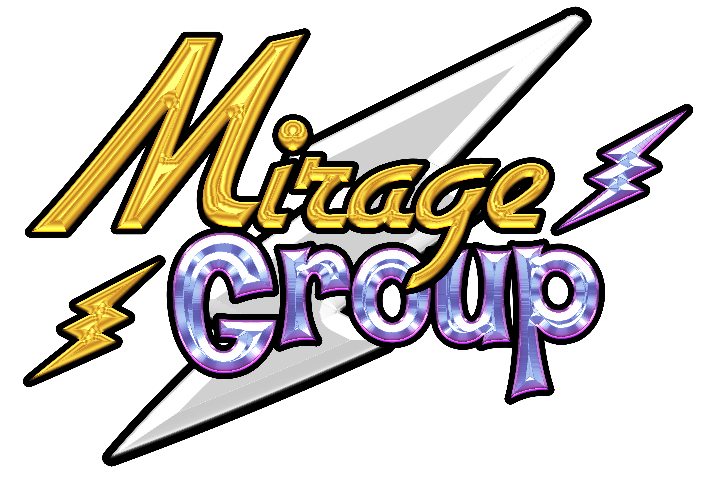

<!DOCTYPE html>
<html lang="en" data-color-mode="auto" data-light-theme="light" data-dark-theme="dark" data-a11y-animated-images="system">
  <head>
  

 
    <a href="#desafios-do-projeto">Desafios do Projeto</a> | 
    <a href="#levantamento">Levantamento de Requisitos</a> |  
    <a href="#prototipo">Protótipo</a> | 
    <a href="#planejamento">Planejamento</a> |
    <a href="#org-equipe">Organização da Equipe</a> | 
    <a href="#org-repo">Organização do Repositório</a>

  
  

  

<h3 align="center" dir="auto">Repositório do projeto de API do 2º semestre do MirageGroup, da 2º turma de ADS da Fatec SJC 2023.</h3>

<h3>### Entregas de Sprints</h3>

Cada entrega foi realizada a partir da criação de uma **tag**. Observe a relação a seguir:
| Sprint| Tag | Lançamento | Status | Histórico |
|:-----:|:-------------:|:----------:|:---------:|:---------:|
| 01 | [sprint-01](https://github.com/MirageGroup/API_MirageGroup_2sem/tree/entrega/sprint-1) | 02/04/2023 | Entregue | [ver relatório](https://github.com/MirageGroup/API_MirageGroup_2sem/tree/entrega/sprint-1#readme) |
| 02 | [sprint-02](https://github.com/MirageGroup/API_MirageGroup_2sem/tree/entrega/sprint-2) | 23/04/2023 | Entregue | [ver relatório](https://github.com/MirageGroup/API_MirageGroup_2sem/tree/entrega/sprint-2#readme) |
| 03 | [sprint-03](https://github.com/MirageGroup/API_MirageGroup_2sem/tree/entrega/sprint---3) | 14/05/2023 | Entregue | [ver relatório](https://github.com/MirageGroup/API_MirageGroup_2sem/tree/entrega/sprint---3) |
| 04 | [sprint-04](https://github.com/MirageGroup/API_MirageGroup_2sem/tree/entrega/sprint-4) | 04/06/2023 | Em desenvolvimento | [ver relatório](https://github.com/MirageGroup/API_MirageGroup_2sem/blob/entrega/sprint-4/README.md) |

→ [Voltar ao topo](#topo)

# Iniciar

  <h1 align="center" dir="auto"><a id="user-content--sprint-1-08032021-a-28032021-" class="anchor" aria-hidden="true" href="#-sprint-1-08032021-a-28032021-"><svg class="octicon octicon-link" viewBox="0 0 16 16" version="1.1" width="16" height="16" aria-hidden="true"><path fill-rule="evenodd" d="M7.775 3.275a.75.75 0 001.06 1.06l1.25-1.25a2 2 0 112.83 2.83l-2.5 2.5a2 2 0 01-2.83 0 .75.75 0 00-1.06 1.06 3.5 3.5 0 004.95 0l2.5-2.5a3.5 3.5 0 00-4.95-4.95l-1.25 1.25zm-4.69 9.64a2 2 0 010-2.83l2.5-2.5a2 2 0 012.83 0 .75.75 0 001.06-1.06 3.5 3.5 0 00-4.95 0l-2.5 2.5a3.5 3.5 0 004.95 4.95l1.25-1.25a.75.75 0 00-1.06-1.06l-1.25 1.25a2 2 0 01-2.83 0z"></path></svg></a> Sprint 4: 15/05/2023 a 04/06/2023    </h1>

 

 
  
 

<!-- <h2 align="center">O Projeto</h2>

  

<h2 align="center">Tecnologias</h2>

 -->

<h2 align="center" dir="auto"><a id="user-content-dart-desafios-do-projeto" class="anchor" aria-hidden="true" href="#dart-desafios-do-projeto"><svg class="octicon octicon-link" viewBox="0 0 16 16" version="1.1" width="16" height="16" aria-hidden="true"><path fill-rule="evenodd" d="M7.775 3.275a.75.75 0 001.06 1.06l1.25-1.25a2 2 0 112.83 2.83l-2.5 2.5a2 2 0 01-2.83 0 .75.75 0 00-1.06 1.06 3.5 3.5 0 004.95 0l2.5-2.5a3.5 3.5 0 00-4.95-4.95l-1.25 1.25zm-4.69 9.64a2 2 0 010-2.83l2.5-2.5a2 2 0 012.83 0 .75.75 0 001.06-1.06 3.5 3.5 0 00-4.95 0l-2.5 2.5a3.5 3.5 0 004.95 4.95l1.25-1.25a.75.75 0 00-1.06-1.06l-1.25 1.25a2 2 0 01-2.83 0z"></path></svg></a><g-emoji class="g-emoji" alias="dart" fallback-src="https://github.githubassets.com/images/icons/emoji/unicode/1f3af.png">🎯</g-emoji> Desafios do Projeto</h2>

 
 

→ <a href="#topo">Voltar ao topo</a>

<h2 align="center" dir="auto"><a id="user-content-pencil-levantamento-de-requisitos" class="anchor" aria-hidden="true" href="#pencil-levantamento-de-requisitos"><svg class="octicon octicon-link" viewBox="0 0 16 16" version="1.1" width="16" height="16" aria-hidden="true"><path fill-rule="evenodd" d="M7.775 3.275a.75.75 0 001.06 1.06l1.25-1.25a2 2 0 112.83 2.83l-2.5 2.5a2 2 0 01-2.83 0 .75.75 0 00-1.06 1.06 3.5 3.5 0 004.95 0l2.5-2.5a3.5 3.5 0 00-4.95-4.95l-1.25 1.25zm-4.69 9.64a2 2 0 010-2.83l2.5-2.5a2 2 0 012.83 0 .75.75 0 001.06-1.06 3.5 3.5 0 00-4.95 0l-2.5 2.5a3.5 3.5 0 004.95 4.95l1.25-1.25a.75.75 0 00-1.06-1.06l-1.25 1.25a2 2 0 01-2.83 0z"></path></svg></a><g-emoji class="g-emoji" alias="memo" fallback-src="https://github.githubassets.com/images/icons/emoji/unicode/1f4dd.png">📝</g-emoji> Levantamento de Requisitos</h2>

Antes de desenvolver o projeto, é necessário entender as necessidades do cliente. Isso é feito através da definição de requisitos e da comunicação constante com o cliente. Com base nisso, é criado um backlog do produto, que lista as principais funcionalidades. Também são criados sprint backlogs e user stories para auxiliar na organização das tarefas da equipe durante o desenvolvimento. Essas etapas garantem que o projeto atenda às expectativas e necessidades do cliente.

<h3><g-emoji class="g-emoji" alias="pushpin" fallback-src="https://github.githubassets.com/images/icons/emoji/unicode/1f4cc.png"></g-emoji> Para verificar os backlogs das sprints e do produto, <a href="https://docs.google.com/spreadsheets/d/1V_c0ld_nKe4g7i_MdmroHyh1VEmcWOaUu1696Ro1hKg/edit?usp=sharing">clique aqui</a>.</h3>
</ul>

<h2 align="center" dir="auto"><a id="user-content-busts_in_silhouette-planejamento-de-classes" class="anchor" aria-hidden="true" href="#busts_in_silhouette-planejamento-de-classes"><svg class="octicon octicon-link" viewBox="0 0 16 16" version="1.1" width="16" height="16" aria-hidden="true"><path fill-rule="evenodd" d="M7.775 3.275a.75.75 0 001.06 1.06l1.25-1.25a2 2 0 112.83 2.83l-2.5 2.5a2 2 0 01-2.83 0 .75.75 0 00-1.06 1.06 3.5 3.5 0 004.95 0l2.5-2.5a3.5 3.5 0 00-4.95-4.95l-1.25 1.25zm-4.69 9.64a2 2 0 010-2.83l2.5-2.5a2 2 0 012.83 0 .75.75 0 001.06-1.06 3.5 3.5 0 00-4.95 0l-2.5 2.5a3.5 3.5 0 004.95 4.95l1.25-1.25a.75.75 0 00-1.06-1.06l-1.25 1.25a2 2 0 01-2.83 0z"></path></svg></a><g-emoji class="g-emoji" alias="busts_in_silhouette" fallback-src="https://github.githubassets.com/images/icons/emoji/unicode/1f4c6.png?v8">📆</g-emoji> Planejamento</h2>

→ <a href="#topo">Voltar ao topo</a>

<h2 align="center" dir="auto"><a id="user-content-desktop_computer-protótipo" class="anchor" aria-hidden="true" href="#desktop_computer-protótipo"><svg class="octicon octicon-link" viewBox="0 0 16 16" version="1.1" width="16" height="16" aria-hidden="true"><path fill-rule="evenodd" d="M7.775 3.275a.75.75 0 001.06 1.06l1.25-1.25a2 2 0 112.83 2.83l-2.5 2.5a2 2 0 01-2.83 0 .75.75 0 00-1.06 1.06 3.5 3.5 0 004.95 0l2.5-2.5a3.5 3.5 0 00-4.95-4.95l-1.25 1.25zm-4.69 9.64a2 2 0 010-2.83l2.5-2.5a2 2 0 012.83 0 .75.75 0 001.06-1.06 3.5 3.5 0 00-4.95 0l-2.5 2.5a3.5 3.5 0 004.95 4.95l1.25-1.25a.75.75 0 00-1.06-1.06l-1.25 1.25a2 2 0 01-2.83 0z"></path></svg></a><g-emoji class="g-emoji" alias="desktop_computer" fallback-src="https://github.githubassets.com/images/icons/emoji/unicode/1f5a5.png">✏️</g-emoji> Protótipo</h2>

Após definir o wireframe, o trabalho de codificação começou, convertendo os desenhos em arquivos de JavaSwing. O protótipo já apresenta cores, tipografia e exemplos de resultados de busca, oferecendo a experiência esperada para o usuário ao interagir com o produto final..

<ul dir="auto">
<li> A primeira fase do protótipo dinâmico foi realizada usando o Figma, e você pode acessá-lo através <a href="https://www.figma.com/file/7A2kfdx0NGFgIC6Kr9HNVP/Prototipo?node-id=0-1&t=Cq5QvALK6oE8nmmQ-0" rel="nofollow">deste link</a>.</li>
</ul>

<h2 align="center" dir="auto"><a id="user-content-busts_in_silhouette-organização-da-equipe" class="anchor" aria-hidden="true" href="#busts_in_silhouette-organização-da-equipe"><svg class="octicon octicon-link" viewBox="0 0 16 16" version="1.1" width="16" height="16" aria-hidden="true"><path fill-rule="evenodd" d="M7.775 3.275a.75.75 0 001.06 1.06l1.25-1.25a2 2 0 112.83 2.83l-2.5 2.5a2 2 0 01-2.83 0 .75.75 0 00-1.06 1.06 3.5 3.5 0 004.95 0l2.5-2.5a3.5 3.5 0 00-4.95-4.95l-1.25 1.25zm-4.69 9.64a2 2 0 010-2.83l2.5-2.5a2 2 0 012.83 0 .75.75 0 001.06-1.06 3.5 3.5 0 00-4.95 0l-2.5 2.5a3.5 3.5 0 004.95 4.95l1.25-1.25a.75.75 0 00-1.06-1.06l-1.25 1.25a2 2 0 01-2.83 0z"></path></svg></a><g-emoji class="g-emoji" alias="busts_in_silhouette" fallback-

<h2 align="center" dir="auto"><a id="user-content-busts_in_silhouette-organização-da-equipe" class="anchor" aria-hidden="true" href="#busts_in_silhouette-organização-da-equipe"><svg class="octicon octicon-link" viewBox="0 0 16 16" version="1.1" width="16" height="16" aria-hidden="true"><path fill-rule="evenodd" d="M7.775 3.275a.75.75 0 001.06 1.06l1.25-1.25a2 2 0 112.83 2.83l-2.5 2.5a2 2 0 01-2.83 0 .75.75 0 00-1.06 1.06 3.5 3.5 0 004.95 0l2.5-2.5a3.5 3.5 0 00-4.95-4.95l-1.25 1.25zm-4.69 9.64a2 2 0 010-2.83l2.5-2.5a2 2 0 012.83 0 .75.75 0 001.06-1.06 3.5 3.5 0 00-4.95 0l-2.5 2.5a3.5 3.5 0 004.95 4.95l1.25-1.25a.75.75 0 00-1.06-1.06l-1.25 1.25a2 2 0 01-2.83 0z"></path></svg></a><g-emoji class="g-emoji" alias="busts_in_silhouette" fallback-src="https://github.githubassets.com/images/icons/emoji/unicode/1f465.png">👥</g-emoji> Organização da Equipe</h2>

Para uma melhor organização do projeto, as habilidades técnicas da equipe foram avaliadas. Em seguida, foram selecionadas as ferramentas e tecnologias a serem utilizadas, e os membros foram temporariamente divididos em dois times principais: Front-end e Back-end. Cada equipe tinha responsabilidades específicas, porém, mantendo constante comunicação entre si.

<ul dir="auto">
<li>A documentação e o acompanhamento das atividades foram realizados pela Scrum Master, que também colaborava com ambos os times de trabalho.

</ul>
</li>
</ul>

<h2>Equipe<h2>
  
<!--  -->

|    Função    | Nome                     |                     GitHub                     |                    Linkedin                    |
| :----------: | :----------------------- | :--------------------------------------------: | :--------------------------------------------: |
| Scrum Master | Victor Guilherme Branco  |    [GitHub](https://github.com/VictorGuui)     | [Linkedin](https://www.linkedin.com/in/victor-branco-323386190/)|
|   PO         | Gustavo Henrique Pereira |    [GitHub](https://github.com/gustavohpereira)| [Linkedin](https://www.linkedin.com/in/gustavohpa/) |
|   Dev Team   | Hugo Henrique da Silva   |    [GitHub](https://github.com/Hugohs98)       | [Linkedin](https://www.linkedin.com/in/hugohsilva/)|
|   Dev Team   | Gustavo Alves dos Santos |    [GitHub](https://github.com/ogustavoalves)  | [Linkedin](https://www.linkedin.com/in/gustavo-alves-073640248/) |
|   Dev Team   | Thiago de Freitas        |    [GitHub](https://github.com/ThiagoCanedo)   | [Linkedin](https://www.linkedin.com/in/thiago-de-freitas-14273818b/)|
|   Dev Team   | Luís Antonio             |    [GitHub](https://github.com/LuisSCardoso)   | [Linkedin](https://www.linkedin.com/in/luis-antonio-souza-cardoso-3928b51a0/) |
|   Dev Team   | Pedro Henrique Pucci     |    [GitHub](https://github.com/pedro11pucci)   | [Linkedin](https://www.linkedin.com/in/pedro-p-122962234/)|
|   Dev Team   | Vinicius Henrique        |    [GitHub](https://github.com/vinicius123henrique321) | [Linkedin](https://www.linkedin.com/in/vinicius-henrique-1a016524a/)|

→ <a href="#topo">Voltar ao topo</a>

<h4 dir="auto"><a id="user-content-file_folder-organização-do-repositório" class="anchor" aria-hidden="true" href="#file_folder-organização-do-repositório"><svg class="octicon octicon-link" viewBox="0 0 16 16" version="1.1" width="16" height="16" aria-hidden="true"><path fill-rule="evenodd" d="M7.775 3.275a.75.75 0 001.06 1.06l1.25-1.25a2 2 0 112.83 2.83l-2.5 2.5a2 2 0 01-2.83 0 .75.75 0 00-1.06 1.06 3.5 3.5 0 004.95 0l2.5-2.5a3.5 3.5 0 00-4.95-4.95l-1.25 1.25zm-4.69 9.64a2 2 0 010-2.83l2.5-2.5a2 2 0 012.83 0 .75.75 0 001.06-1.06 3.5 3.5 0 00-4.95 0l-2.5 2.5a3.5 3.5 0 004.95 4.95l1.25-1.25a.75.75 0 00-1.06-1.06l-1.25 1.25a2 2 0 01-2.83 0z"></path></svg></a><g-emoji class="g-emoji" alias="file_folder" fallback-src="https://github.githubassets.com/images/icons/emoji/unicode/1f4c1.png">📁</g-emoji> Organização do Repositório</h4>

Para facilitar o trabalho remoto da equipe, foram estabelecidos padrões para configurar um ambiente de trabalho compartilhado, visando manter a organização, garantir transparência e facilitar o acesso aos recursos desejados.

→ <a href="#topo">Voltar ao topo</a>

</body>
</html>
